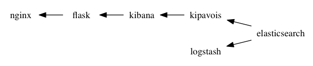

This repository demonstrates usage of [cogniteev/kipavois](https://github.com/cogniteev/kipavois)
NodeJS proxy thru a Docker Compose application.

## Requirements

You may have installed:

* docker-compose 1.4.0 or higher installed
* docker registry (either on your workstation or thru docker-machine) up and running

## Usage

To start the application:

```shell
docker-compose up
```

Go to this url: http://docker_registry/monitor
where *docker_registry* is:

* `localhost` if docker is installed on your workstation
* IP of your docker-machine machine. You can get it by running `docker-machine ip <NAME>`. To get list of available machine, use the `docker-machine ls` command.


## Containers Linkage



* Logstash container pushes CSV data into Elastisearch, and then stop.
* Nginx performs basic authentication and acts as proxy for an uwsgi flask application
* Flask application processes requests as follow:
  1. adds an `x-kibana-user` HTTP header, value if the username authenticated in nginx. If the username is `admin`, then the HTTP header is not added.
  1. forward requests to kipavois, and stream the result back to nginx
* Kibana leverage Elasticsearch to build dashboards
* Kipavois receives Elasticsearch requests made by Kibana and process the queries as follow:
  * If the `x-kibana-user` is set:
    * requests that try to modify Kibana configuration are rejected.
    * Another filter is added to search queries so that only data that belongs to the authenticated user are fetched.
  * Otherwise, the request is not altered, passed to Elasticsearch and streamed by to Kibana.

## Rationale

Here, authentication is made by Nginx, and the Flask application is almost useless. It is possible to specify the `x-kibana-user` in nginx configuration.

But in the real application where Kipavois is used, Flask application is taking
care of authentication, not nginx. The Flask container here is used to
demonstrate the [flask-kipavois](https://pypi.python.org/pypi/flask-kipavois/)
Python module used it.

## License

`KiPavois-POC` is licensed under the Apache License, Version 2.0.
See [LICENSE](LICENSE) file for full license text.
